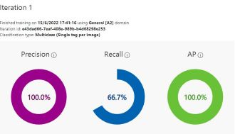

Pasos para crear un Inteligencia que reconozca astros.

1.- Nos vamos a [Custom Vision](https://www.customvision.ai/)

2.- Iniciamos sesion.

3.- Le damos ahora en New Project.

4.- Ocupamos crear un recurso, asi que le damos en **Nuevo recurso**.

5.- Una ves llenado, le damos listo.

6.- A continuacion seguimos acompletando la creacion del recurso.

7.- Una ves terminado, vamos a añadirle imagenes y le ponemos un tag.

8.- Ahora subimos mas imagenes con otro tags diferentes.

9.- Subimos mas imagenes pero a estas le ponemos un tag negativo

10.- Ahora le damos en train, para que la inteligencia empice a estudiar las imagenes.

11.- Le damos en entrenamiento rapido, para que no nos cueste demasiado.

------------------------------------------------------------------------------------------------------
En **probability Threshold**, es para que tu pongas que porcentaje de exactitud quieres.

**Obviamente, mientras mas exactitud, mas tiempo va a entrenar, por que entrenara hasta que llegue al porcentaje.**

--------------------------------------------------------------------------------------------------------

12.- Ahora solo toca esperar y que se complete el porcentaje de interaction.

13.-  Una ves que finalice nos presentara los procentajes de su entrenamiento.

14.- Ahora vamos a darle quick  Test, donde debemos copiar la direccion de la imagen y la inteligencia nos arrojara lo que es.

15.- Listo, asi podemos ir poniendo difernetes imagenes y que nos diga la inteligencia artificial, que es para ella.

----------------------------------------------------------------------------------------
